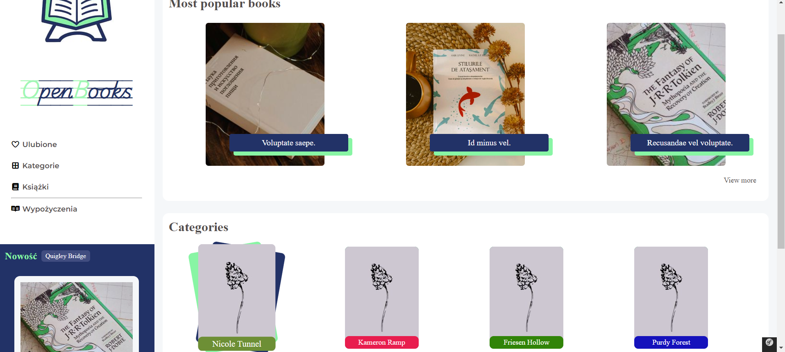
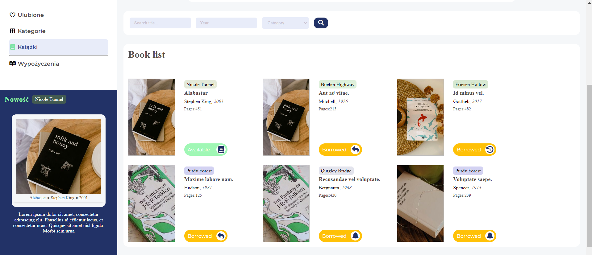
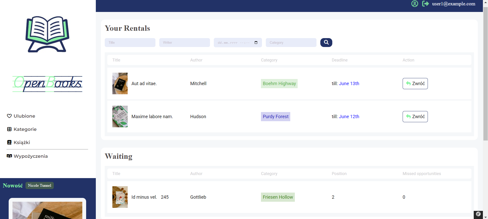
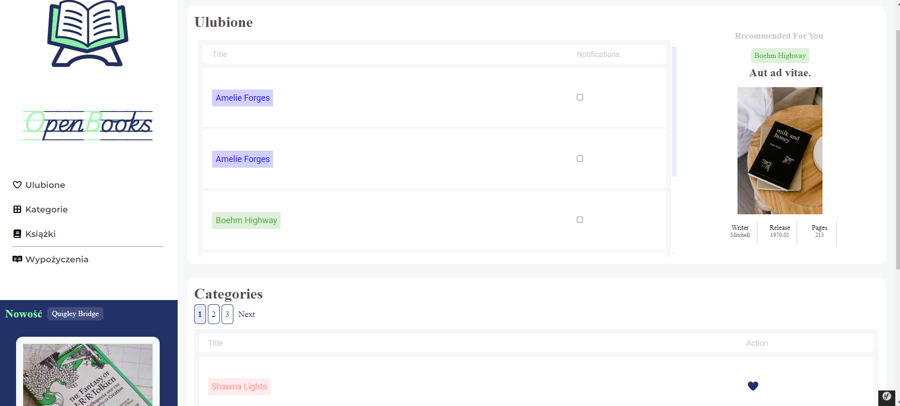
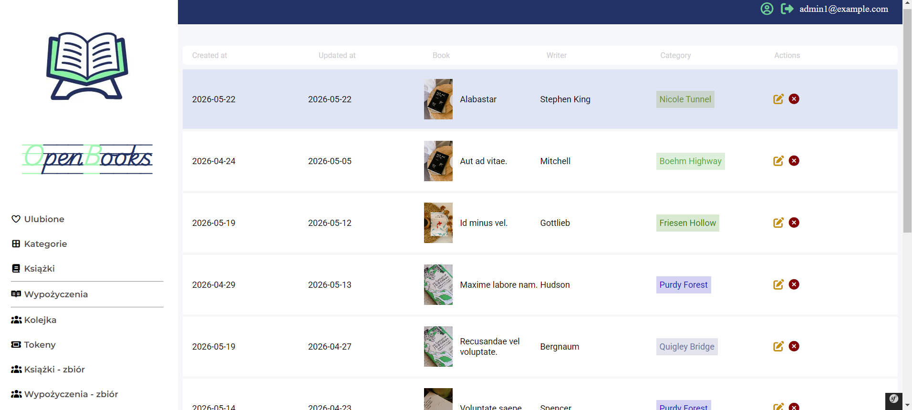

# Open Books

Open Books is a web application that imitates an online library with book rentals, waiting queues and token-based reservation system.

* [Technologies Used](#technologies-used)
* [Features](#features)
* [How It Works](#how-it-works)
* [Screenshots](#screenshots)
* [Setup](#setup)

## Technologies used
- PHP 8.4
- Symfony 8
- Twig 3
- Doctrine ORM
- MySQl

## Features
- Book rental system
- Queue system for unavailable books
- Token-based rental confirmation
- Personalized book recommendations
- Email notifications
- Rental history and queue tracking

## How It Works

Authenticated user can rent available books or join to waiting queue when the book is currently borrowed. When a user reaches the first position in the queue, the application sends an email with the link activation that allows them to create a rental for the book. The application checks the token before confirming the rental.
Users can also choose their favorite book categories and received the personalized book recommendation based on their preferences. They can manage notification settings, browse their rental history and track their current queue positions.

### Notification System
The application includes an email notification system that inform users about:
- available books from their queues,
- newly added books matching their favorfite categories
- notification about successfully created rental

### Admin panel
Admins have access to some additional features related to managing application resources, such us creating categories and books. They can also manage rentals and browse queues and tokens.

## Screenshots

### Home Page
- Displaying categories and most rented books.


### Books Page
- Displaying books with their statuses.


### Rentals Page
- Displaying currently rented books and waiting list.


### Favorite Categories Page
- Displaying favorites categories with the ability to turn notifications on and off; and a book recommendation.


### Admin Page
- Sample admin page for browsing books.


## Setup
To start the project:
 - configure your .env file

```yaml
DATABASE_URL=
MAILER_DSN=
```

```bash
cd open-books
composer install
```

 - run migrations:
 ```bash
 php bin/cosnole doctrine:migrations:migrate
 ```

 - start the server:
 ```bash
 symfony server:start
 ```

 - load fixtures:
 ```bash
 php bin/console doctrine:fixtures:load
 ```

 Demo users:
 - login: user1@example.com, password: user123
 - login: admin1@example.com, password: admin123

 


